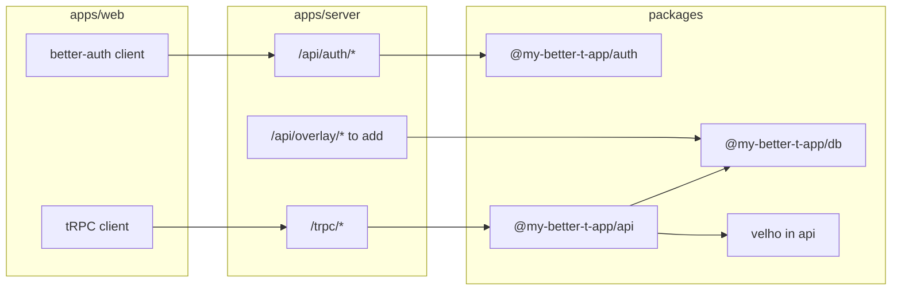
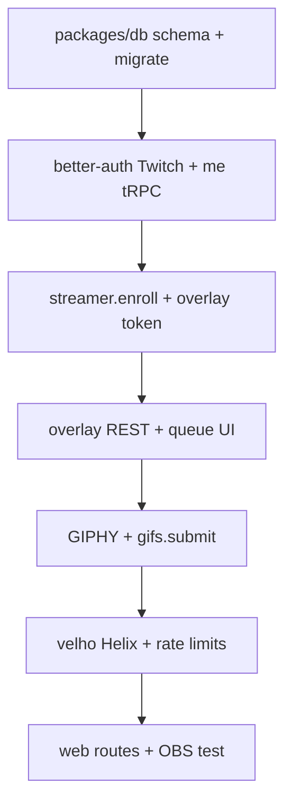

# Twitch GIF Overlay Website Plan

## Summary

Build a Twitch GIF overlay app on the existing **Bun + Turbo monorepo**: Vite React web app (`apps/web`), Elysia API server (`apps/server`), PostgreSQL with Drizzle (`packages/db`), and shared packages for auth, API, env, and UI.

Users sign in with **Twitch via better-auth** (sessions in PostgreSQL). **[velho](https://www.npmjs.com/package/velho)** is used for **Helix only** (live stream checks via `HelixClient` + app access token). Users pick a default `selected_role` (`streamer` or `viewer`) for landing, but may **enroll as a streamer and submit GIFs as a viewer** at the same time.

- Viewers choose an enrolled streamer who is currently live, search/select a GIPHY GIF, and submit it.
- Streamers enroll their channel and add a browser-source overlay URL to OBS.
- OBS overlay URL path is generated randomly and saved to streamer details, e.g. `/overlay/<token>`.
- The OBS overlay shows GIFs submitted by viewers with **~1–2s latency via polling**.
- V1 uses instant display (auto-approve to overlay queue) with **no streamer moderation queue**, but submissions are **rate-limited** (see Abuse & fairness).

**Scaffold state (repo today):** email/password auth on `/login` is placeholder. Velho, GIPHY, domain tables, Twitch provider, and product tRPC procedures are **not implemented yet** — planned on top of the better-t-app scaffold.

## Key Changes

### App Structure

Monorepo layout (Bun workspaces + Turbo):

```
apps/
  web/          # Vite + React 19 + TanStack Router + tRPC client + better-auth client
  server/       # Elysia (Bun): mounts /api/auth/*, /trpc/*, overlay REST (to add)
packages/
  api/          # tRPC routers and procedures (@my-better-t-app/api)
  auth/         # better-auth instance, Drizzle adapter (@my-better-t-app/auth)
  db/           # Drizzle schema, migrations, createDb() (@my-better-t-app/db)
  env/          # Zod-validated env — server + VITE_* web (@my-better-t-app/env)
  ui/           # Shared UI components (@my-better-t-app/ui)
  config/       # Shared TypeScript config
```

**Tooling:** Bun (`packageManager: bun@1.3.14`), Turbo, Biome (`bun run check`).

**Root scripts** (`package.json`):

- `bun run dev` — web + server via Turbo
- `bun run dev:web` / `bun run dev:server`
- `bun run db:migrate` | `db:push` | `db:generate` | `db:studio` — runs against `@my-better-t-app/db`
- `bun run build` | `check-types`

**Environment variables** (validated in `packages/env`; extend during implementation):

| Variable | Package | Purpose |
|----------|---------|---------|
| `DATABASE_URL` | server | PostgreSQL connection |
| `BETTER_AUTH_SECRET` | server | Sign better-auth session cookies |
| `BETTER_AUTH_URL` | server | Public API base URL (OAuth callbacks) |
| `CORS_ORIGIN` | server | Allowed web origin (credentials) |
| `NODE_ENV` | server | `development` \| `production` \| `test` |
| `VITE_SERVER_URL` | web | API base URL for tRPC + auth client |
| `TWITCH_CLIENT_ID` | server | better-auth Twitch provider + Velho (to add) |
| `TWITCH_CLIENT_SECRET` | server | better-auth Twitch provider + Velho (to add) |
| `GIPHY_API_KEY` | server | GIPHY search proxy (to add) |

OAuth redirect URI is derived from `BETTER_AUTH_URL` (e.g. `{BETTER_AUTH_URL}/api/auth/callback/twitch`) — no separate redirect env.

**Deployment & local dev:**

- **Server:** `http://localhost:3000` (`apps/server`, `bun run dev:server`)
- **Web:** `http://localhost:3001` (`apps/web`, `bun run dev:web`)
- Web calls the server via `VITE_SERVER_URL=http://localhost:3000` (no Vite proxy; cross-origin with credentials)
- `CORS_ORIGIN` must match the web origin (e.g. `http://localhost:3001` in dev)
- Prod: `BETTER_AUTH_URL` and `VITE_SERVER_URL` point at the public API origin; cookies are `httpOnly` + `secure` in `packages/auth` (adjust `sameSite` for local HTTP if needed during dev)
- Run Drizzle migrations on deploy: `bun run db:migrate`

**Request flow:**



### Package responsibilities

- `@my-better-t-app/db` — Drizzle schema (`packages/db/src/schema/`), `createDb()`, drizzle-kit migrations
- `@my-better-t-app/auth` — better-auth config, Drizzle adapter, Twitch social provider (to add)
- `@my-better-t-app/api` — tRPC `appRouter`, procedures, Velho/GIPHY service modules (to add)
- `@my-better-t-app/env` — `server` and `web` env modules with Zod
- `@my-better-t-app/ui` — shared design-system components for web

### Authentication And Roles

**better-auth** (`packages/auth`, mounted at `/api/auth/*` on `apps/server`):

- Add **Twitch social provider**; disable or remove email/password for v1.
- Sessions in `session` table; sign-in/out via better-auth API (`authClient` in `apps/web/src/lib/auth-client.ts`).
- Twitch OAuth tokens in `account` row (`providerId: twitch`): `accessToken`, `refreshToken`, `accessTokenExpiresAt` — never exposed to the frontend.

**velho** (add to `packages/api` or `apps/server`):

- **Helix only** — live stream checks via `HelixClient` + app access token (`getAppAccessToken`).
- Not a second OAuth stack; login stays on better-auth.

**Domain data** (new Drizzle tables, keyed by `user.id` text PK from better-auth):

- `selected_role`, streamer enrollment, GIF submissions — see Data Model.
- After first login, if `selected_role` is unset, route to `/choose-role`.

**OAuth scopes** (v1):

- User login: Twitch scopes via better-auth provider (profile identity from OAuth / Helix as needed).
- Live checks: **app access token** + `GET /streams?user_id=...` via Velho — no broadcaster token required for v1.

**Role semantics**:

- `selected_role` is `streamer` or `viewer` — controls **default landing route** after login only.
- Streamer enrollment is independent: a `streamer_profiles` row means the user can use the streamer dashboard and overlay regardless of current `selected_role`.
- Users may enroll as a streamer **and** use the viewer flow in the same session.
- Settings UI: change `selected_role`; enroll or unenroll streamer channel separately; sign out via better-auth.

### Streamer Flow

- Add streamer enrollment for the logged-in Twitch channel.
- **Enrollment**: creating a `streamer_profiles` row sets `is_enrolled = true` and generates `overlay_token` (crypto-random, e.g. 32 bytes hex) in one transaction.
- Store streamer profile data: Twitch channel ID/login, enrollment status, overlay token.
- Streamer dashboard should show:
  - enrollment status
  - OBS overlay URL (`{webOrigin}/overlay/{overlayToken}`)
  - basic overlay preview
  - recent submitted GIFs
  - **Regenerate overlay URL** — tRPC `streamer.regenerateOverlayToken` — invalidates the previous token
- Use overlay URL `/overlay/:overlayToken` so OBS access is not based on public usernames.

### Viewer Flow

- Viewer can follow a streamer link to go directly to that streamer's page; track how many visitors have used that link.
- Viewer page fetches enrolled streamers and filters to streamers currently live on Twitch.
- Viewer selects one live streamer.
- Viewer searches GIPHY through the backend (tRPC `giphy.search`); show **Powered by GIPHY** attribution on the search UI.
- Viewer submits one selected GIF (tRPC `gifs.submit` with `streamerProfileId` = **`streamer_profiles.id` (UUID)**, not Twitch login).
- Backend validates:
  - viewer is logged in (tRPC `protectedProcedure`)
  - target streamer is enrolled
  - streamer is currently live (fresh Helix check via Velho, no cache)
  - GIF payload comes from GIPHY result data
  - rate limits and queue cap (see Abuse & fairness)
- Store submitted GIFs in PostgreSQL.

**Live status**:

- tRPC `streamers.listLive`: Helix `streams` via Velho; **cache 60–90s** per channel (in-memory or `live_checked_at` on profile).
- `gifs.submit`: **re-check live** without cache; return `400` or `409` if offline.

### OBS Overlay Flow

- Build a public overlay route for OBS browser source at `apps/web/src/routes/overlay/$overlayToken.tsx` (TanStack Router).
- Overlay fetches the API server directly (not tRPC): simple `fetch` with credentials only where needed; poll/ack are **unauthenticated** token-based REST on `apps/server`.
- Since v1 uses PostgreSQL only, implement realtime behavior with lightweight polling:
  - overlay polls `GET /api/overlay/:overlayToken/gifs?after=<lastSeenId>` every **1–2 seconds** (Elysia route **to add**)
  - `after` = last seen submission `id` (monotonic bigint); response is ascending by `id`, empty array if none
  - on initial load with no `after`, return submissions from the last **30 minutes** only (avoid replaying full history)
- **Client-side FIFO queue**: polling only appends; overlay plays **one GIF at a time** for **10 seconds** (config constant), then advances.
- **Backlog cap**: server rejects new submissions when the streamer already has **>20** rows with `displayed_at IS NULL`.
- When the overlay **starts** showing a GIF, call `POST /api/overlay/:overlayToken/ack` with `{ submissionId }` to set `displayed_at` (**to add**).
- Include CSS suitable for transparent OBS browser source:
  - transparent background
  - no visible controls
  - GIF appears large and centered
  - smooth fade in/out

### Abuse & fairness

V1 has no streamer moderation UI; “instant display” means submissions are **auto-approved into the overlay queue**, not held for streamer click-through.

| Rule | V1 default |
|------|------------|
| Submit rate | 1 GIF per viewer per streamer per **30 seconds** |
| Duplicate GIFs | Reject same `giphy_id` for the same streamer within **5 minutes** |
| Overlay backlog | Server rejects when **>20** undisplayed (`displayed_at IS NULL`) |
| Display time | **10 seconds** per GIF on the overlay |

## Data Model

PostgreSQL via Drizzle in `packages/db`.

### better-auth tables (existing — `packages/db/src/schema/auth.ts`)

- `user` — `id` (text PK), `name`, `email`, `emailVerified`, `image`, timestamps
- `session` — better-auth sessions (`userId` → `user.id`)
- `account` — OAuth providers (`providerId`, `accountId`, tokens per provider)
- `verification` — verification tokens

**Planned extensions:**

- Add `selected_role` on `user` **or** a `user_preferences` table (`user_id` → `user.id`, `selected_role` nullable until first choice: `streamer` | `viewer`).
- Twitch identity: use `account` where `providerId = 'twitch'` (`accountId` = Twitch user id); map display name / avatar from OAuth profile or Helix as needed.

### Domain tables (to add — `packages/db/src/schema/`)

#### `streamer_profiles`

- `id` (UUID) — public `streamerProfileId` in tRPC inputs
- `user_id` (text, unique — references `user.id`, one profile per user)
- `twitch_channel_id` (indexed)
- `twitch_channel_login`
- `is_enrolled`
- `overlay_token` (unique)
- `live_checked_at` (optional, for live-list cache)
- `created_at`
- `updated_at`

#### `gif_submissions`

- `id` (bigint, monotonic — overlay `after` cursor)
- `streamer_profile_id` (indexed with `id` for polling)
- `viewer_user_id` (text, references `user.id`; indexed with `streamer_profile_id`, `created_at` for rate limits)
- `giphy_id`
- `gif_url`
- `title`
- `displayed_at` (null = not yet shown on overlay)
- `created_at`

Export all schemas from `packages/db/src/schema/index.ts`. Run `bun run db:generate` and `bun run db:migrate` after schema changes.

## API Surface

App features use **tRPC** (`packages/api`, mounted at `/trpc/*` on `apps/server`). Web client: `apps/web/src/utils/trpc.ts` with `credentials: "include"`.

### better-auth (existing)

- `GET|POST /api/auth/*` — Twitch sign-in, sign-out, OAuth callback (library-handled)

### tRPC procedures (to add on `appRouter`)

| Procedure | Purpose |
|-----------|---------|
| `healthCheck` | Already exists |
| `me.get` | Current user + `selected_role` + streamer profile summary |
| `me.setRole` | Set `selected_role` |
| `streamer.enroll` | Create/update enrolled `streamer_profiles` row + overlay token |
| `streamer.regenerateOverlayToken` | Invalidate old token, issue new one |
| `streamers.listLive` | Enrolled streamers filtered to live (Helix via Velho, cached) |
| `giphy.search` | Proxy GIPHY search (`q` input) |
| `gifs.submit` | Submit GIF (`streamerProfileId`, GIPHY payload); validates live + rate limits |

Protected procedures use `protectedProcedure` (session from `createContext` in `packages/api/src/context.ts`).

### Elysia REST (to add on `apps/server` — OBS overlay)

- `GET /api/overlay/:overlayToken/gifs?after=...`
- `POST /api/overlay/:overlayToken/ack` — body `{ submissionId }`, sets `displayed_at`

Token in URL authenticates overlay access; no session cookie required.

The backend must hide Twitch, GIPHY, and `BETTER_AUTH_SECRET` from the frontend.

## Frontend Pages

**TanStack Router** file-based routes under `apps/web/src/routes/`. Shared UI from `@my-better-t-app/ui`.

| Route | File | Status |
|-------|------|--------|
| `/login` | `login.tsx` | Exists — replace email/password with Twitch sign-in |
| `/choose-role` | `choose-role.tsx` | To add |
| `/viewer` | `viewer.tsx` | To add |
| `/streamer` | `streamer.tsx` | To add |
| `/settings` | `settings.tsx` | To add |
| `/overlay/$overlayToken` | `overlay/$overlayToken.tsx` | To add — minimal layout for OBS |
| `/` | `index.tsx` | Exists — landing / redirect |
| `/dashboard` | `dashboard.tsx` | Exists — remove or repurpose after migration |

**Routing:** after login, redirect by `selected_role` if set; otherwise `/choose-role`. Streamer dashboard and viewer flow are both reachable when applicable.

## Test Plan

- Unit tests in `packages/api` for validation: role, enrollment, GIF submit, rate limits, queue cap.
- Integration tests: Velho/Helix and GIPHY wrappers with mocked responses; better-auth session in tRPC context.
- Server tests for overlay REST poll/ack routes.
- Verify viewer cannot submit to non-enrolled or offline streamers.
- Verify overlay polling returns only GIFs newer than `after`.
- Verify rate limit and duplicate `giphy_id` rejection.
- Verify regenerating overlay token invalidates polls with the old token (`401` or `404`).
- Verify server rejects submit when **>20** undisplayed GIFs exist.
- E2E happy path (mocked Helix live): tRPC submit → overlay poll → ack → `displayed_at` set.
- Manually test with `bun run dev`:
  - Twitch login flow
  - streamer enrollment
  - viewer GIF search and submission
  - OBS overlay route displaying submitted GIFs
  - transparent overlay styling in a browser window sized like OBS

## Implementation phases

Build in this order (on the existing monorepo, not greenfield `frontend/` / `backend/`):

1. Extend `packages/db` schema (`streamer_profiles`, `gif_submissions`, role field) + `bun run db:migrate`
2. Twitch provider in `packages/auth` + tRPC `me.get` / `me.setRole` + replace `/login` UI
3. `streamer.enroll` + overlay token + web `/streamer` route
4. Overlay REST poll/ack on `apps/server` + `/overlay/$overlayToken` queue UI
5. GIPHY proxy + `giphy.search` + `gifs.submit`
6. Add `velho` to `packages/api`; `streamers.listLive` + live check on submit + rate limits
7. Remaining web routes (`/viewer`, `/settings`, `/choose-role`) + manual OBS test



## Assumptions

- V1 stack matches the repo: Bun workspaces, Turbo, `apps/web` (Vite React), `apps/server` (Elysia), `packages/db` (Drizzle + PostgreSQL).
- **better-auth** owns Twitch login and sessions; **velho** owns Helix live checks only.
- App API is **tRPC**; OBS overlay uses **REST** on `apps/server` for simple polling.
- Users can be enrolled streamers and active viewers at the same time; `selected_role` is only the default landing preference.
- GIFs are auto-queued for the overlay without streamer moderation in v1.
- Twitch live status via Velho + Helix; live **list** cached ~60–90s; **submit** always re-checks live.
- GIPHY search is proxied through tRPC with required attribution in the UI.
- PostgreSQL polling (~1–2s) is acceptable for v1 overlay latency; WebSockets deferred to v2.
- OBS overlay URLs use unguessable tokens rather than plain usernames.
